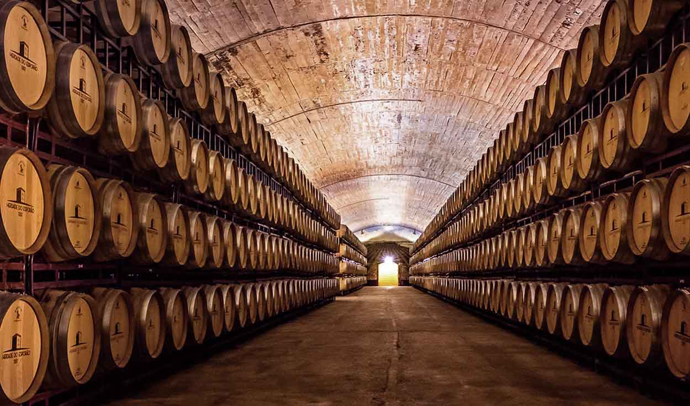

# Programming for Data Analysis Project

## Examination of a red wine dataset

## Problem statement

Create a data set by simulating a real-world phenomenon. 
Pick any phenomenon - Then, model and synthesise such data using Python.

## Wine dataset

The wine dataset is data relating to Portuguese red wine and was downloaded from [kaggle](https://www.kaggle.com/).
There are eleven chemical or physiochemical variables with the twelfth variable being based on sensory data, i.e. manually tasting the wine and grading it.

## Process

A jupyter notebook is used for examining the dataset and the following process is used:

1) Import all required libraries for analysis, plotting, etc.
2) Examine the dataset - number of variables, variable types.
3) Format dataset if necessary.
4) Visual summary of variables and basic statistics that will be used for synthesis of data.
5) Generate synthetic data for each variable.
6) Check probability distribution of each synthesised variable.
7) Look for patterns between variables and quality, i.e. correlation between physiochemical variables and variable containing sensory data.
8) Conclusion to summarise the above
9) References lising all resources used.